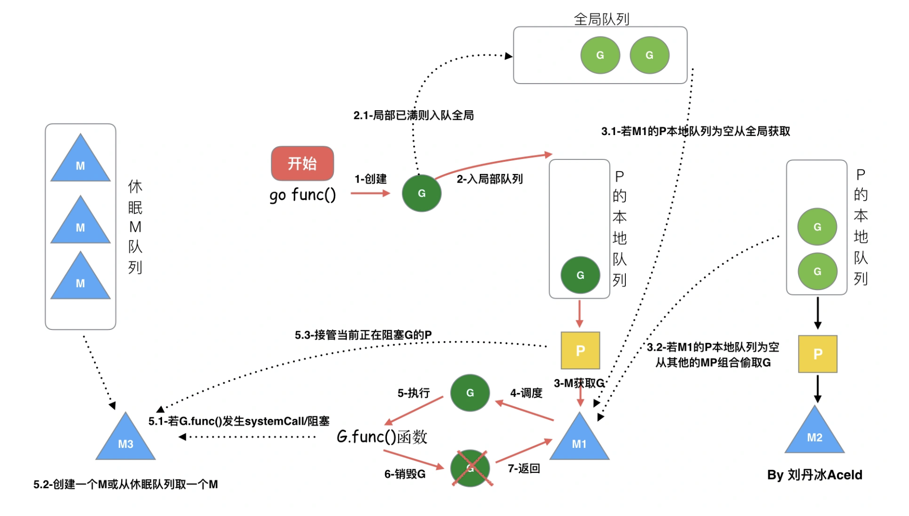

# GPM<3> 调度设计

#### GPM

**G:** Goroutine，Goroutine这个概念来自协程，一个Goroutine必须必须绑定到P上才能被CPU执行。Goroutine非常轻量，创建一个Goroutine只需要几kb的内存资源\(实际上这个内存资源是动态的，如果有需要runtime会为goroutine自动分配资源\)。

**P:** Processer, 即为G和M的调度对象，用来调度G和M之间的关联关系，其数量可通过GOMAXPROCS\(\)来设置，默认为CPU核心数。

**M:** Machine, OS 内核线程抽象，代表着真正执行计算的资源，在绑定有效的 P 后，执行P调度出来的G。M的数量由runtime决定\(默认最大1000\)。M 并不保留 G 状态，这是 G 可以跨 M 调度的基础。

Go调度器的是由这GPM构成的。

#### 调度器初期设计

调度器初期的设计是并没有P，仅有G与M，造成了如下弊端。

1.如每次M调度G都需要获G全局队列的锁，造成了激烈的锁竞争。

2.无法实现G的局部性（即从当M1执行G1时，G1创建出来的G1'无法保证任然被M1执行）

3.频繁地M切换导致系统开销加大

#### 调度器进阶设计

基于旧的调度器的弊端，Go设计了一个全新的调度器。再新的调度器中，加入了P。M是G运行的实体，P负责把G分配到M上进行执行，M才是真真正正的“干活者”。

1.全局队列：存放等待执行的G。

2.本地队列：存放等待运行的G，队列最多只能放256个G。当某个G创建一个新的G'时，会优先放入当前P的本地队列中 。如果本地队列已满，则将本地队列的一半G放到全局队列中。

#### M0与G0

M0：进程启动后编号为0的主线程，他负责初始化和执行第一个G，启动完成后便与其他G一样了。

G0：每启动一个M，都会创建一个G0，G0不承载任何可执行函数。在P准备切换G之前，会先切换到G0，它是两个G之前转换的桥梁。

#### go func\(\)调度流程

#### 调度器的核心策略

调度器的核心策略是**复用线程**，**避免频繁的创建、销毁线程，而是对线程的复用**。接下来通过各种场景来体现调度器是如何**复用线程**的。

