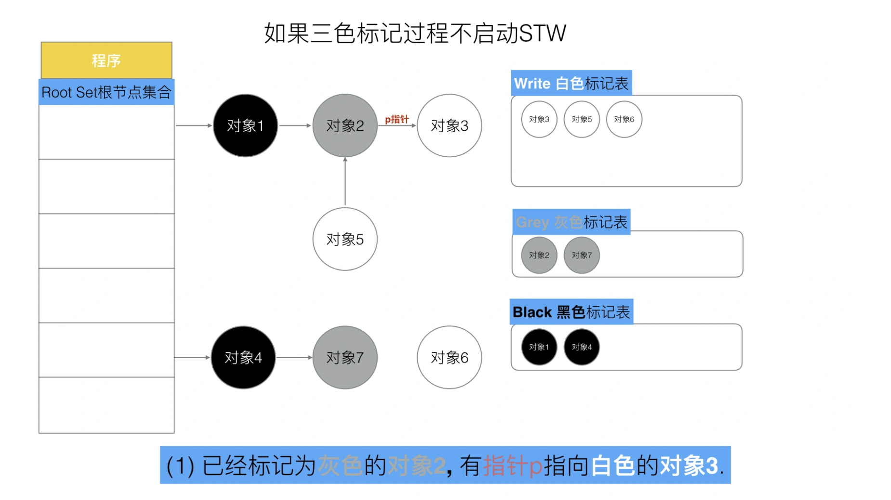
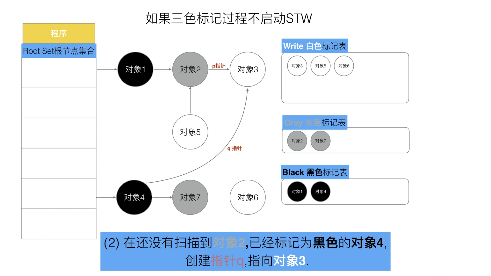
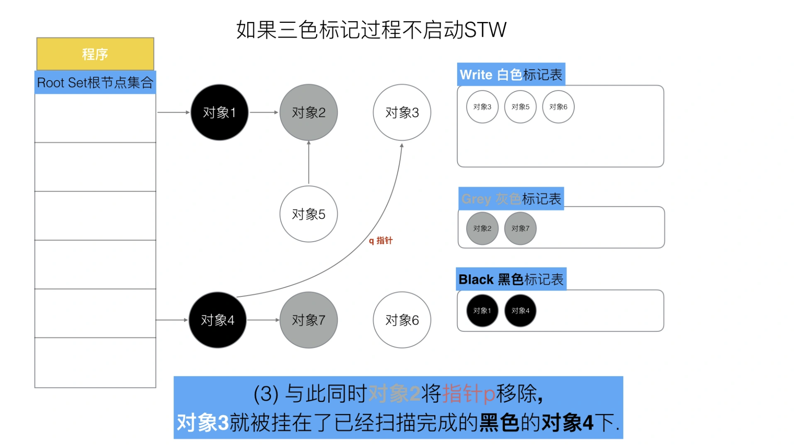
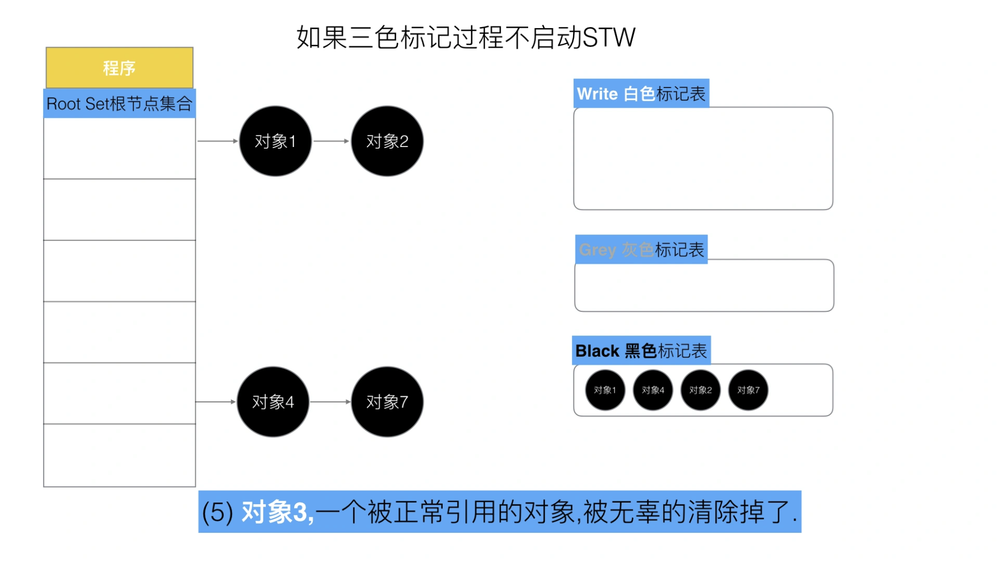
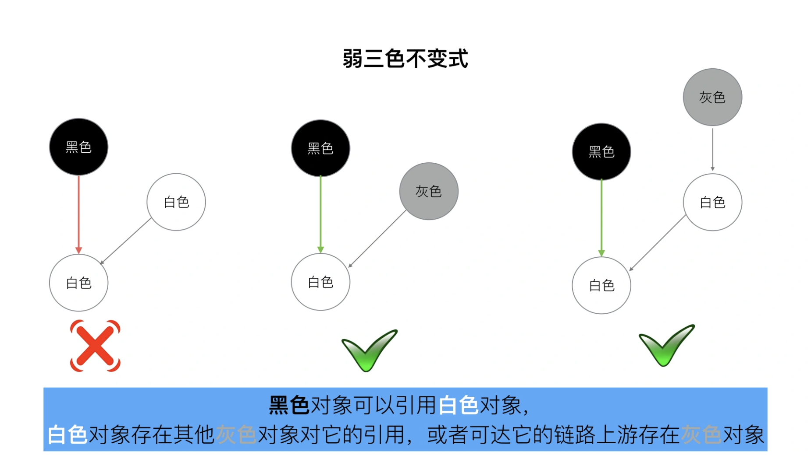
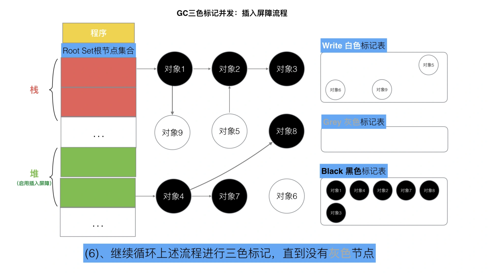
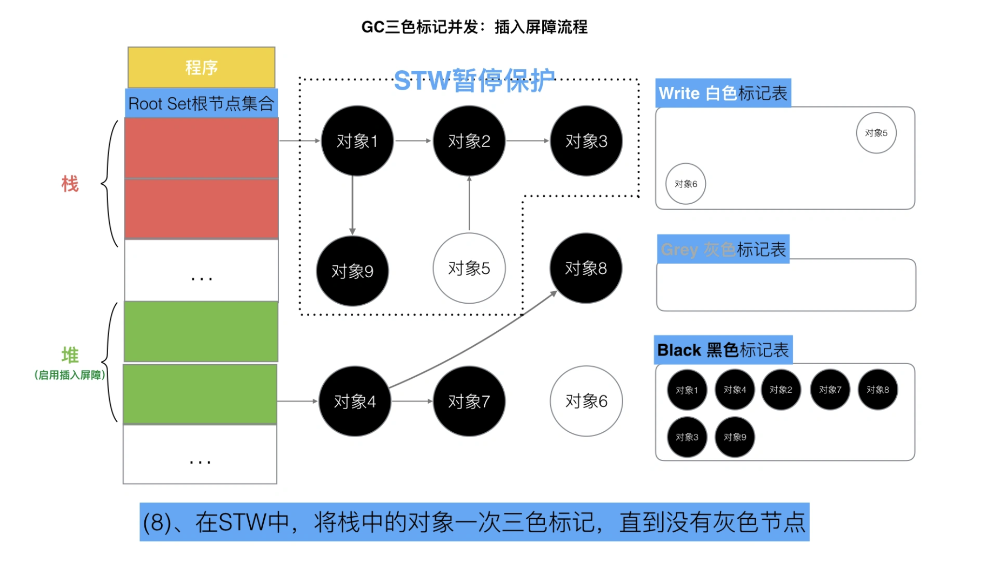
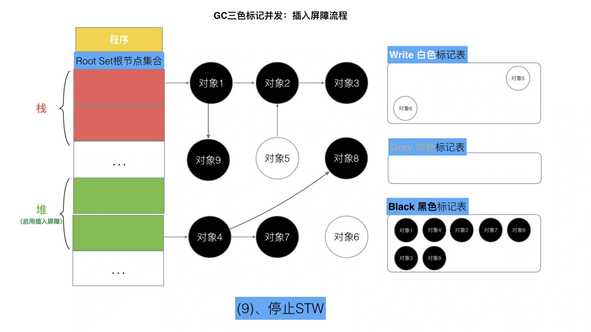
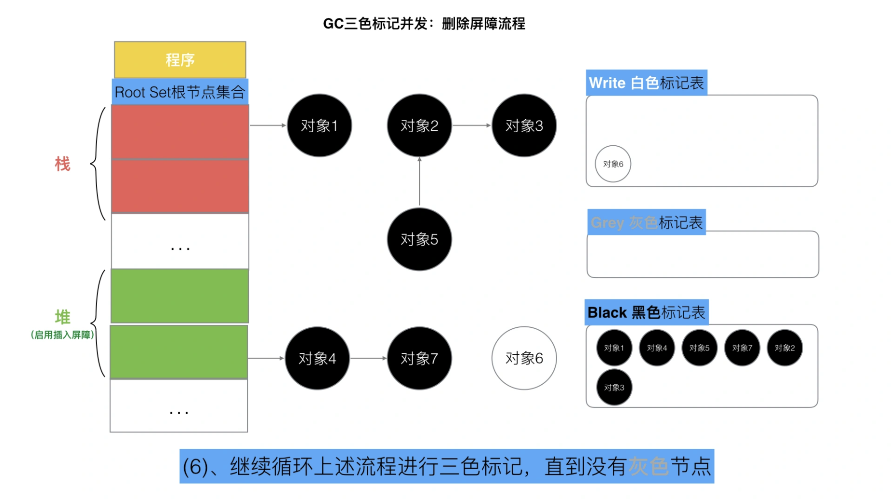
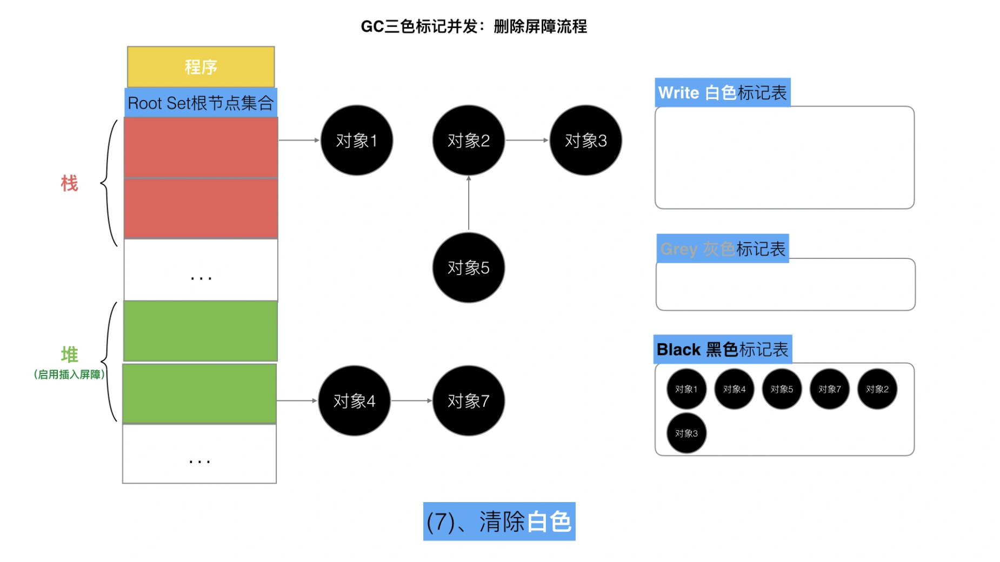

# Golang之GC

### 为什么要有GC

当程序启动的时候，操作系统会给程序分配堆区与栈区，栈区里的内存是可以自动管理的，当栈区变量的作用域结束，可以被自动收回。堆区属于程序员自己管理的区域，即使堆区变量的作用域结束，后续可能继续使用。所以对于堆区的内存，程序员需要实时关注，如果内存一直增长没有释放，则会溢出，如果内存释放后还继续访问，则会出现非法访问。那有没有一种机制能够让堆区的闲置的内存自动回收？GC可以帮我们做到。GC\(Ggrbage Collect\)即垃圾回收，它可以通过一定的策略，让程序自动管理内存，让开发者更增加专注业务的开发。

---

### GC常用的策略

1. **引用计数法**。引用计数法为对象维护一个计数器，当对象被引用时，计数器加1，引用被释放，计数器减1，当计数器为0时，表示没有被引用，清除这个对象。引用计数法实现简单，但频繁更新计数器会带来一定开销，且无法解决循环引用的弊端。
2. **标记\-清除法**。标记\-清除法是对对象定时进行标记，标记为“正在使用”与“没有被使用”两种，标记完后对标记为“没有被使用”的进行清除。由于程序是动态在运行的，随时有可能改变对象引用指向，因此，在标记的时候需要STW\(Stop The World\)，即程序停止一段时间，这段时间专门用来做标记。

### Golang中的GC策略

Golang在v1.5之前是使用**清除\-标记法**的策略进行GC，但v1.5使用了**三色标记法**，所谓三色标记法就是通过三个阶段来去定对象的状态（黑色/白色/灰色分别代表三个不同的状态）。

* 白色：初始对象
* 灰色：要被清除的对象
* 黑色：任然在使用的对象

1.创建新对象，全部为白色

2.每次开始GC回收，从根节点开始遍历所有所有对象，把能遍历到的放入灰色对象集合中。

3.遍历灰色对象集合，把灰色对象的引用放入灰色对象集合，然后将自己置入黑色对象集合。

4.重复第3步，直至灰色集合中没有任何对象。

5.全部遍历完后，内存中只存在黑色、白色两种颜色的对象，只需要清除掉所有没有对象引用的白色对象，即完成一轮GC。

---

#### 三色标记法任然需要STW

三色标记法仍然少不了STW，引文如果程序跟标记对象颜色的过程是同时进行的，当对象之间的引用关系被修改时，会出现一些问题。

1.假设我们已经经过了GC的第一阶段的扫描，当前状态如下图：

2.如果此时三色标记过程没有STW保护，那么对象4通过q指针指向对象3。

3.接着对象2指向对象3的p指针被移除，那么白色对象3就只挂在黑色对象4下了。

4.然后按照正常的标记逻辑，灰色对象2与灰色对象7被置为黑色，此时全局已经没有灰色对象了，标记完毕，白色对象3/5/6被清除。

从上述流程可以看出，白色对象3本身是有被引用的，但却被清除掉了。

---

#### 强/弱三色不变式

Golang为了解决上面这种误删的情况，定义了两个规则，这两个规则即是“**强三色不变式**”与“**弱三级不变式**”。所有的对象引用都必须遵循这两个规则。

##### 强三色不变式

强三色不变式规则：**黑色对象引用白色对象时，强制将对象置为灰色**。

##### 弱三色不变式

弱三色不变式规则：**被黑色对象可以引用白色对象，但是白色对象的上游必须存在灰色对象**

---

#### 插入/删除屏障

##### 插入屏障

插入屏障是为了满足**强三色不变式**，在A对象引用B对象时，B对象需强制置于灰色。需要注意的是，只有对象在堆区才会触发插入屏障，在栈区的对象不会触发插入屏障。（**因为在栈区的内存由系统自动分配，函数栈弹入弹出频繁，出于对性能的考虑，所以不会在栈区触发插入写屏障**）。我们通过场景来展示下这个流程。

1.某次GC执行过程如图所示。

2.由于GC跟程序是同时执行的，此时栈区的黑色对象1引用了新的对象9，堆区的黑色对象4引用了对象4。

3.根据插入写屏障，黑色对象4的下游对象8要变成灰色，但栈区并不触发插入写屏障机制，所以黑色对象1的下游对象9任然为白色

6.继续循环标记颜色，直到没有灰色对象。这时栈区存在被引用的对象任然被标记为白色的情况（对象9任然白色）。

7.所以这时要对栈区的对象重新进行三色标记扫描，为了保护栈区对象，需要STW来保护栈区的对象。

8.对被STW保护下的栈区对象重新进行三色标记扫描，直到没有灰色对象。

9.最后一步，停止STW ，清除没有被引用的白色对象。

插入写屏障极大减少了STW的时间，**只需要在扫描栈区的时候需要STW**，比全局的STW效率要提高不少。

##### 删除屏障

删除屏障满足**弱三色不变式**，当A对象为白色/灰色对象，删除对下游的B对象的引用时，B对象需要置为灰色。这样做的目的是保护A对象下游的白色对象，**确保灰色对象到白色对象的可达路径不会断**。依然通过场景来分析。

1.当前某次GC执行过程如图所示。

2.对象1删除对对象5的引用。

3.根据删除写屏障机制，对象5需要被置为灰色。

4.循环标记，直至没有灰色对象。

5.删除没有被引用白色对象6。

删除屏障在GC开始时会扫描整个栈做快照，从而在删除操作的时候，可以拦截操作，将白色对象置为灰色。

这种删除屏障机制还有一个缺陷，即对象5已经与对象1解除引用了，那么对象5/2/3应该在这轮GC就被清除，那为什么任然需要继续扫描标记呢？其实是为了**满足弱三色不等式**。假如对象4引用了对象5，那么对象5又会被无辜删除。那么对象5什么时候被清除？当下一轮GC的时候，没有从root节点的路径能到达对象5，对象5自然被清除掉了。

---

#### 混合写屏障

插入写屏障与删除写屏障的缺点：

- 插入写屏障：结束时需要STW来重新扫描栈，标记栈上引用的白色对象的存活
- 删除写屏障：回收精度低，GC开始时STW扫描堆栈来记录初始快照，这个过程会保护开始时刻的所有存活对象

Golang在v1.8版本时基于插入/删除屏障推出了**混合写屏障**\(hybrid write barrier\)机制，极大地减少了STW的时间。混合写屏障的规则：

- GC开始将栈上所有可达对象都置为黑色（之后不再进行二次扫描，无需STW）
- GC期间任何在栈上创建的新对象都置为黑色
- 被删除的对象都置为灰色
- 被添加的对象置为灰色

Golang v1.8版本的混合写屏障的机制满足弱三色不变式，结合了删除写屏障和插入写屏障的的优点，只需要在开始时并发扫描各个goroutine的栈，使其变黑并一直保持，这个过程不需要STW。而标记结束后，因为栈在扫描后始终是黑色的，也无需再进行re-scan操作了，减少了STW的时间。
