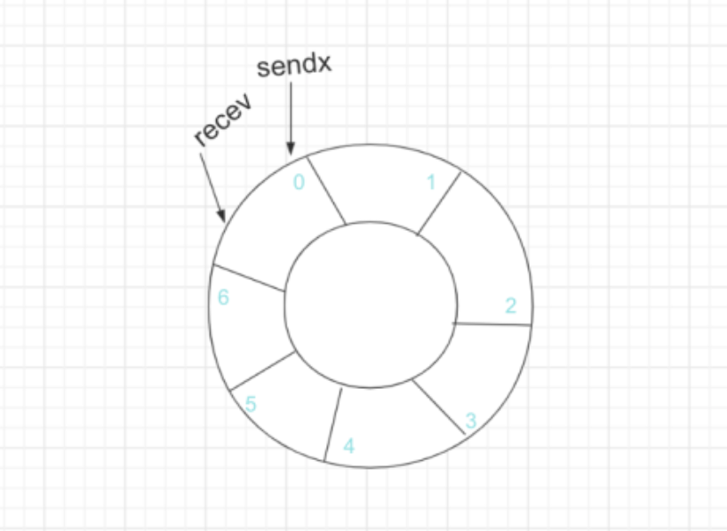

# Golang之channel

### channel

channel是支撑Go语言高性能并发编程模型的重要结构，channel是一个用于同步和通信的有锁队列，使用互斥锁解决程序中可能存在的线程竞争问题。以下内容基于：

```shell
go version go1.16.2 darwin/amd64
```

### channel的数据结构

channel其是用runtime.hchan来表示的。

```go
type hchan struct {
	qcount   uint           // 缓冲区里有几个元素
	dataqsiz uint           // 缓冲区最多有几个元素 即缓冲区大小
	buf      unsafe.Pointer // 指向底层循环数组的指针
	elemsize uint16         // 元素大小
	closed   uint32        // 是否关闭
	elemtype *_type        // 元素的类型
	sendx    uint         // 已发送元素在环形数组中的索引
	recvx    uint         // 已接受元素在环形数组中的索引
	recvq    waitq        // 等待接受的goroutine队列
	sendq    waitq        // 待发送的goroutine队列
    
	lock mutex            //锁 保护数据
}
```

recvq与sendq是waitq类型的数据，分别代表接受的g队列与发送的g队列，waitq是一个双端链表。

```go
type waitq struct {
	first *sudog
	last  *sudog
}
```

buf是一个指向一个环形数组的指针，sendx与recvx分别代表在这个环形数组中的发送位置与接收数据，之所以用环形数组是因为这样可以重复利用空间。



整体示意图


---

### 创建一个channel

创建channel最终使用的是runtime.makechan\(\)这个函数。

```go
func makechan(t *chantype, size int) *hchan {
    ...
    
	var c *hchan
	switch {
	case mem == 0: // =>创建无缓冲通道的channel
		c = (*hchan)(mallocgc(hchanSize, nil, true))
		c.buf = c.raceaddr()
	case elem.ptrdata == 0: // =>创建有缓冲通道但元素里不含指针的channel
		c = (*hchan)(mallocgc(hchanSize+mem, nil, true))
        //给buf分配一块连续的内存空间
		c.buf = add(unsafe.Pointer(c), hchanSize)
	default: // =>创建有缓冲通道并且元素含有指针的channel
		c = new(hchan)
        //给buf单独分配内存空间
		c.buf = mallocgc(mem, elem, true)
	}
    ...
}
```

---

### 向channel发送数据

向channel发送数据最终调用的是runtime.chansend，其函数签名为：

```go
func chansend(c *hchan, ep unsafe.Pointer, block bool, callerpc uintptr) bool {
    ...
}
```

其中，bolock参数表示遇到channel操作不能成功时是否需要阻塞。往channel发送数据操作不成功的情景：

1. 往无buffer的channel发送数据而接收者还没ready
2. 往buffer已满的channel里发送数据
3. 往nil的channel里发送数据

block为false即不阻塞的情况，如select里的channel操作：

```go
func main() {
    ch := make(chan int)
    select {
        case: ch <- 0:
        default:
    }
    ...
}
```

block为true即阻塞的情况，如往无buffer的channel发送数据：

```go
func main() {
    ch := make(chan int)
    ch <- 0
    ...
}

```

具体看看往一个channel里发送数据的流程。

```go
func chansend(c *hchan, ep unsafe.Pointer, block bool, callerpc uintptr) bool {

        省略若干代码...
        
        //非阻塞 且 channel未关闭 且 channel已满
	if !block && c.closed == 0 && full(c) {
		return false
	}

        //操作前先上锁
	lock(&c.lock)
        
        //往已关闭的channel里发送数据会panic
	if c.closed != 0 {
		unlock(&c.lock)
		panic(plainError("send on closed channel"))
	}

         //如果能从接收者的G队列的队头取出一个G，说明已经有接收者ready，也说明了：
            //1.带缓冲的channle的buffer为空，因为如果buffer不为空的话接收者可以直接从buffer里取到数据，不会再将接收者放在接收者队列里
            //2.channel不带缓冲
	if sg := c.recvq.dequeue(); sg != nil {
                //针对上面1.2两种情况 都可以将数据传递给这个接收者 并且唤醒等待者G 
		send(c, sg, ep, func() { unlock(&c.lock) }, 3)
		return true
	}
    
        //缓冲channel的buffer未满
	if c.qcount < c.dataqsiz {
                //将数据放到缓冲buffer中即可返回
		qp := chanbuf(c, c.sendx)
		if raceenabled {
			racenotify(c, c.sendx, nil)
		}
		typedmemmove(c.elemtype, qp, ep)
		c.sendx++ //发送索引位置更新
		if c.sendx == c.dataqsiz {
			c.sendx = 0 //因为是环形的所以重新回到head
		}
		c.qcount++
		unlock(&c.lock)
		return true
	}

	if !block {
		unlock(&c.lock)
		return false
	}

        //走到这里说明往通道里发送的数据没有把法被对端接收，即
        //1.往无缓冲的channel发送数据而接收者还没ready
        //2.往有缓冲的channel发送数据但buffer已满
        
        //获取当前G
	gp := getg()
	mysg := acquireSudog()
	mysg.releasetime = 0
	if t0 != 0 {
		mysg.releasetime = -1
	}

	mysg.elem = ep
	mysg.waitlink = nil
	mysg.g = gp
	mysg.isSelect = false
	mysg.c = c
	gp.waiting = mysg
	gp.param = nil
	c.sendq.enqueue(mysg) //将当前的G入队到发送等待队列sendq
	atomic.Store8(&gp.parkingOnChan, 1)
        
        //gopar将当前的G挂起 达到阻塞当前G的效果
	gopark(chanparkcommit, unsafe.Pointer(&c.lock), waitReasonChanSend, traceEvGoBlockSend, 2)

	KeepAlive(ep)

	// 数据被接收者接收 当前G被唤醒 后面做一系列收尾工作
	if mysg != gp.waiting {
		throw("G waiting list is corrupted")
	}
	gp.waiting = nil
	gp.activeStackChans = false
	closed := !mysg.success
	gp.param = nil
	if mysg.releasetime > 0 {
		blockevent(mysg.releasetime-t0, 2)
	}
	mysg.c = nil
	releaseSudog(mysg)
	if closed {
		if c.closed == 0 {
			throw("chansend: spurious wakeup")
		}
		panic(plainError("send on closed channel"))
	}
	return true
}
```

---

### 从channel接收数据

从channel接收数据最终调用的是runtime.chanrecv，其函数签名如下：

```go
func chanrecv(c *hchan, ep unsafe.Pointer, block bool) (selected, received bool){
    ...
}
```

同样低，block参数表示在channel操作无法完成时是否需要阻塞。从channel接收数据操作不成功的情景：

1. 从无缓冲的channel里接收数据而发送者还没ready
2. 从有缓冲但buffer为空的channel里接受数据
3. 从nil的channel里读取数据

block为false即不阻塞的情况，如select里的channel操作：

```go
func main() {
    ch := make(chan int)
    select {
        case: <-ch:
        default:
    }
    ...
}
```

block为true即阻塞的情况，如从无buffer的channel接收数据：

```go
func main() {
    ch := make(chan int)
    data := <-ch 
    ...
}

```

具体看看从一个channel里接收数据的流程

```go
func chanrecv(c *hchan, ep unsafe.Pointer, block bool) (selected, received bool) {

	// 省略若干代码... 

        // 从一个nil channel 里接收数据
	if c == nil {
		if !block {
			return //非阻塞  直接返回
		}
                //阻塞 当前G会永久阻塞
		gopark(nil, nil, waitReasonChanReceiveNilChan, traceEvGoStop, 2)
		throw("unreachable")
	}
        
        // 省略若干代码... 

	lock(&c.lock)

    // 如果通道被关闭 且 buffer里没有元素 这里可以返回了
	if c.closed != 0 && c.qcount == 0 {
		if raceenabled {
			raceacquire(c.raceaddr())
		}
		unlock(&c.lock)
		if ep != nil { 
			typedmemclr(c.elemtype, ep)
		}
		return true, false
	}

    //如果能从发送者G队列取出一个G，说明当前有发送者ready，也说明了：
    //1.带缓冲的channle的buffer已满，因为如果buffer未满的话接收者可以直接往buffer里发送数据，不会再将发送者放到发送者队列里，也就不会有ready的发送者。
    //2.channel不带缓冲
	if sg := c.sendq.dequeue(); sg != nil {
                 //1.如果是带缓冲的channel 且buffer已满，除了需要从buffer里去读数据拷贝给接收变量ep外，还需要将发送者G的数据放入buffer，调整发送位置索引， 并且唤醒这个发送者G，以保证FIFO  
                //2.如果是没有缓冲的channel的情况就直接将数据拷贝给接收变量ep
		recv(c, sg, ep, func() { unlock(&c.lock) }, 3)
		return true, true
	}

        //如果是带缓冲的channel 且buffer里任然有数据了 那么直接从buffer里拿数据即可
	if c.qcount > 0 {
                //qp 即从hcha.buf里获取channel buffer里面的数据
		qp := chanbuf(c, c.recvx)
		if raceenabled {
			racenotify(c, c.recvx, nil)
		}
                //将qp赋值接收者变量ep
		if ep != nil {
			typedmemmove(c.elemtype, ep, qp)
		}
		typedmemclr(c.elemtype, qp)
		c.recvx++ //接收索引位置更新
		if c.recvx == c.dataqsiz {
			c.recvx = 0 //接收队列是环形数组 需重新置位为0
		}
		c.qcount--
		unlock(&c.lock)
		return true, true
	}
    
    //到这说明接收者当前没办法接收数据了 即
    //1.不带缓冲channel & 没有发送者发送数据
    //2.不带缓冲channel & buffer里没有数据
    
    //不阻塞的话就返回了
	if !block {
		unlock(&c.lock)
		return false, false
	}
    
    
	// 获取当前G 封装成sodog
	gp := getg()
	mysg := acquireSudog()
	mysg.releasetime = 0
	if t0 != 0 {
		mysg.releasetime = -1
	}
	// No stack splits between assigning elem and enqueuing mysg
	// on gp.waiting where copystack can find it.
	mysg.elem = ep
	mysg.waitlink = nil
	gp.waiting = mysg
	mysg.g = gp
	mysg.isSelect = false
	mysg.c = c
	gp.param = nil
	c.recvq.enqueue(mysg) //将当前G入队

	atomic.Store8(&gp.parkingOnChan, 1)
    
    // 使用gopark阻塞当前G
	gopark(chanparkcommit, unsafe.Pointer(&c.lock), waitReasonChanReceive, traceEvGoBlockRecv, 2)

	//当前G被唤醒
	if mysg != gp.waiting {
		throw("G waiting list is corrupted")
	}
	gp.waiting = nil
	gp.activeStackChans = false
	if mysg.releasetime > 0 {
		blockevent(mysg.releasetime-t0, 2)
	}
	success := mysg.success
	gp.param = nil
	mysg.c = nil
	releaseSudog(mysg)
	return true, success
}

```

