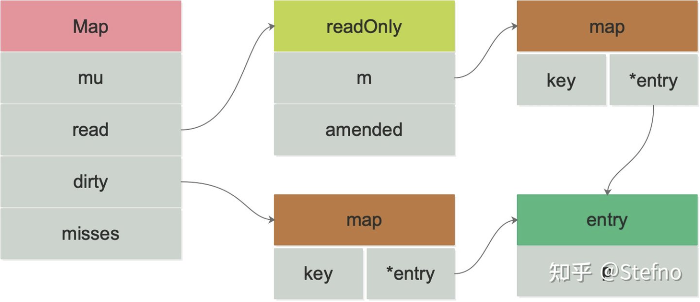

# Golang之sync.Map

### map的并发操作

从前面文章的分析可以看到，原生的map如果并发读写的话，会抛出异常。

```go
	if h.flags&hashWriting != 0 {
		throw("concurrent map read and map write")
	}
```

也就是说原生的map不是并发安全的。如果要实现并发安全，可以在操作map的时候加一把mutex锁。但官方提供了更高效的sync.Map，使其能在并发安全的前提下更加高效地读写。

---

### sync.Map数据结构

```go
type Map struct {

	mu Mutex //互斥锁 保护dirty字段

	read atomic.Value //只读数据 实际类型为sync.readOnly

	dirty map[interface{}]*entry //写入数据 操作前需先加锁
 
	misses int //每次从read读取失败（read穿透） misses+1
}
```

其中sync.readOnly的数据结构

```go
type readOnly struct {
	m       map[interface{}]*entry
	amended bool //如果dirty里存在m中没有的key 这个值为true
}
```

sync.entry用来存储指向value的指针

```go
type entry struct {
	p unsafe.Pointer // *interface{}
}
```

其中，read与dirty里各自维护着一套key，key指向的都是同一个entry，也就是说只要修改了这个entry，那么read与dirty都是可见的。



entry.p有三种状态，分别是：

1. p == nil
2. p == expunged
3. 其他

---

### sync.Map原理

* 通过read与dirty两个字段，将读写操作分离，读的数据只存在只读字段read上，新写入的数据则放到dirty中。
* 读取的时候会先读read，read中没有再查询dirty。
* 读取read不加锁，但操作dirty需要mutex保护。
* misses字段表示read读取失败但是在dirty读到（read被穿透）的次数，当misses达到一定值，需要将dirty升级为read，已减少miss的次数。
* 对于删除的数据通过标记来延迟删除。

### sync.Map操作

TODO...

