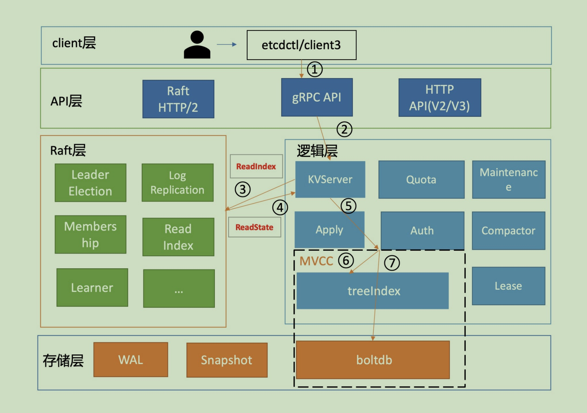

# etcd

​    etcd是CoreOS基于Raft协议开发的[分布式](https://so.csdn.net/so/search?q=分布式&spm=1001.2101.3001.7020)key-value存储，可用于服务发现、共享配置以及一致性保障（如数据库选主、分布式锁等）。

- 简单：[curl](https://so.csdn.net/so/search?q=curl&spm=1001.2101.3001.7020)可访问的用户的API（HTTP + JSON）
- 安全：可选的SSL客户端证书认证
- 快速： 单实例每秒1000次写操作
- 可靠：使用Raft算法保证一致性

## 架构

- **Client层**：client层包括client v2和v3两个⼤版本API客⼾端库，提供了简洁易⽤的API，同时⽀持负载均衡、节点间故障⾃动转移，可极⼤降低业务使⽤etcd复杂度，提升开发效率、服务可⽤性。

- **API网络层**：API⽹络层主要包括client访问server和server节点之间的通信协议。⼀⽅⾯，client访问etcd server的API分为v2和v3两个⼤版本。v2 API使⽤HTTP/1.x协议，v3 API使⽤gRPC协议。同时v3通过etcd grpc-gateway组件也⽀持HTTP/1.x协议，便于各种语⾔的服务调⽤。另⼀⽅⾯，server之间通信协议， 是指节点间通过Raft算法实现数据复制和Leader选举等功能时使⽤的HTTP/2协议。 

- **Raft算法层**：Raft算法层实现了Leader选举、⽇志复制、ReadIndex等核⼼算法特性，⽤于保障etcd多个etcd是典型的读多

  节点间的数据⼀致性、提升服务可⽤性等，是etcd的基⽯和亮点。

- **功能逻辑层**：etcd核⼼特性实现层，如典型的KVServer模块、MVCC模块、Auth鉴权模块、Lease租约模 块、Compactor压缩模块等，其中MVCC模块主要由treeIndex模块和boltdb模块组成。 

- **存储层**：存储层包含预写⽇志(WAL)模块、快照(Snapshot)模块、boltdb模块。其中WAL可保障etcd crash后数据不丢失，boltdb则保存了集群元数据和⽤⼾写⼊的数据。

## 读取数据

etcd有两种读取数据的模式，分别是**串行读**与**线性读**，其中线性读是**默认**的读取方式。再说读取数据之前先简单说明下写的流程。当client发起⼀个更新hello为 world请求后，若Leader收到写请求，它会将此请求持久化到WAL⽇志，并⼴播给各个节点，若⼀半以上节点持久化成功，则该请求对应的⽇志条⽬被标识为已提交，etcdserver模块异步从Raft模块获取已提交的⽇志条⽬，应⽤到状态机(boltdb等)。 

此时若client发起⼀个读取hello的请求，假设此请求直接从状态机中读取， 如果连接到的是C节点，若C节 点磁盘I/O出现波动，可能导致它应⽤已提交的⽇志条⽬很慢，则会出现更新hello为world的写命令，在 client读hello的时候还未被提交到状态机，因此就可能读取到旧数据，如上图查询hello流程所⽰。从以上介绍我们可以看出，在多节点etcd集群中，各个节点的状态机数据⼀致性存在差异。⽽我们不同业务场景的读请求对数据是否最新的容忍度是不⼀样的，有的场景它可以容忍数据落后⼏秒甚⾄⼏分钟，有的场 景要求必须读到反映集群共识的最新数据。

### *串行读*

**串行读**模式下，服务器⽆需通过Raft协议与集群进⾏交互，而是直接直接返回状态机的数据。这种方式适用对**对数据敏感度较低的场景**。它具有低延时、⾼吞吐量的特点，**适合对数据⼀致性要求不⾼的场景**。例如一个旁路数据统计服务，希望每分钟统计下etcd⾥的服务、配置信息等，这种场景其实对数据时效性要求并不⾼，读请求可直接从节点的状态机获取数据。即便数据落后⼀点，也不影响业务，毕竟这是⼀个定时统计的旁路服务⽽已。 如果是串行读，那就就不回经过架构图中的3、4步骤。

### *线性读*

**线性读**可以理解⼀旦⼀个值更新成功，随后任何通过线性读的client都能及时访问到。虽然集群中有多个节点，但client通过线性读就如访问⼀个节点⼀样。etcd默认读模式是线性读，因为它需要经过Raft协议模块，反应的是集群共识，因此在延时和吞吐量上相⽐串⾏读略差⼀点，**适⽤于对数据⼀致性要求⾼的场景**。 

经过上面的分析可知，串⾏读之所以能读到旧数据，主要原因是Follower节点收到Leader节点同步的写 请求后，应⽤⽇志条⽬到状态机是个异步过程，那么我们能否有⼀种机制在读取的时候，确保最新的数据已经应⽤到状态机中？ 其实这个机制就是叫ReadIndex，它是在etcd 3.1中引⼊的，我把简化后的原理图放在了上⾯。当收到⼀个 线性读请求时，**它⾸先会从Leader获取集群最新的已提交的⽇志索引(committed index)。**

Leader收到ReadIndex请求时，为防⽌脑裂等异常场景，会向Follower节点发送⼼跳确认，⼀半以上节点确 认Leader⾝份后才能将已提交的索引(committed index)返回给节点C(上图中的流程三)。C节点则会等待，直到状态机已应⽤索引(applied index)⼤于等于Leader的已提交索引时(committed Index)(上图中的流程四)，然后去通知读请求，数据已赶上Leader，你可以去状态机中访问数据了(上图中的 流程五)。 

总体⽽⾔，KVServer模块收到线性读请求后，通过架构图中流程三向Raft模块发起ReadIndex请求，Raft模块将Leader最新的已提交⽇志索引封装在流程四的ReadState结构体，通过channel层层返回给线性读模块，线性读模块等待本节点状态机追赶上Leader进度，追赶完成后，就通知KVServer模块，进⾏架构图中流程五，与状态机中的MVCC模块进⾏进⾏交互了。

## MVCC

MVCC是为了解决etcd v2不⽀持保存key的历史版本、不⽀持多key事务等问题⽽产⽣的。 它核⼼由内存树形索引模块(treeIndex)和嵌⼊式的KV持久化存储库boltdb组成。boltdb是一个基于B+ tree实现的key-value键值库，⽀持事务，提供Get/Put等 简易API给etcd操作。 那么etcd如何基于boltdb保存⼀个key的多个历史版本呢? treeIndex模块则是基于Google开源的内存版btree库实现的，treeIndex模块只会保存⽤⼾的key和相关版本号信息，⽤⼾key的value数据存储在boltdb模块⾥⾯。

- 方案一：是⼀个key保存多个历史版本的值。这种方法会导致value较⼤，存在明显读写放⼤、并发冲突等问题。
- 方案二：每次修改操作，⽣成⼀个新的版 本号(revision)，以版本号为key，value为⽤⼾key-value等信息组成的结构体。etcd采用的是这种方案，以版本号为key，value为⽤⼾key-value等信息组成的结构体，然后通过treeindx模块来保存用户key与版本号的映射关系。

treeIndex与boltdb关系如下⾯的读事务流程图所⽰，从treeIndex中获取key hello的版本号，再以版本号作为boltdb的key，从boltdb中获取其value信息。 

## 写入数据

etcd写入数据的整体流程如下：

